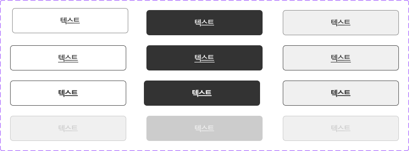
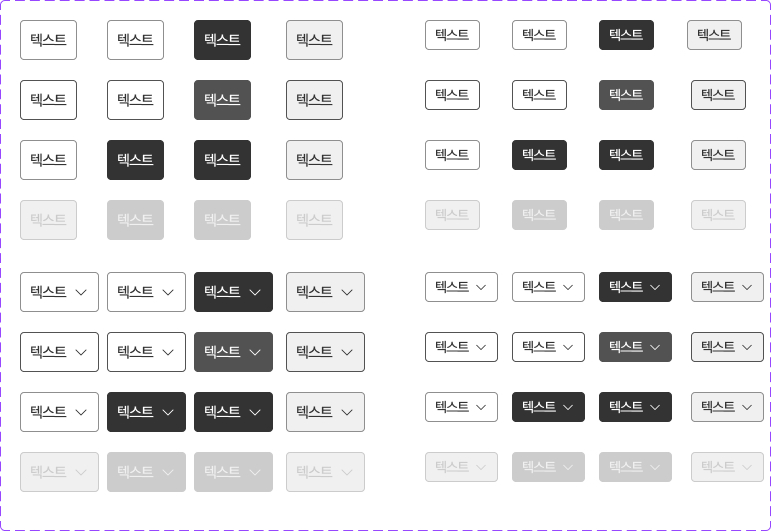

This documents describe button styles. The buttons is extended from **Button** components from PrimeVue UI-Kit collection.
You can read more about it [here](https://primevue.org/button/)

**Table of Contents**

[TOC]


##  Big button (WelfareBigButton)


The CSS class was written in file **welfare-button.css**. The Vue component is **WelfareBigButton**.
You can see detail more in file **BigButtonView**.

```html
    <WelfareBigButton label="텍스트" buttonType="default" />
    <WelfareBigButton label="텍스트" buttonType="cancel" />
    <WelfareBigButton label="텍스트" buttonType="neatral" disabled />
```

#### Props
Defines valid properties in **WelfareBigButton** component.
Name  | Type  | Description
------------- | ------------- | -------------
label  | string | Text of the button.
disabled  | boolean | Mark button in disabled state
class  | any | Style class of the button.	
buttonType  | "neatral", "default", "cancel"  | The type of button.
#### Emits
Defines valid emits in **WelfareBigButton** component.
Name  | Parameters |   ReturnType  | Description
------------- |  ------------- | ------------- | -------------
onClick  |  | void | The click event of button.


##  Medium button (WelfareMdButton)


The CSS class was written in file **welfare-button.css**. The Vue component is **WelfareMdButton**.
You can see detail more in file **MdButtonView**.

```html
    <WelfareMdButton label="텍스트" buttonType="liner" />
    <WelfareMdButton label="텍스트" buttonType="neutral" />
    <WelfareMdButton label="텍스트" buttonType="default" />
    <WelfareMdButton label="텍스트" buttonType="cancel" disabled />
```

#### Props
Defines valid properties in **WelfareMdButton** component.
Name  | Type  | Description
------------- | ------------- | -------------
label  | string | Text of the button.
disabled  | boolean | Mark button in disabled state
class  | any | Style class of the button.	
buttonType  | "liner", "neutral", "cancel", "default"  | The type of button.
buttonSize  | "small", "default"  | The size of button.
#### Emits
Defines valid emits in **WelfareMdButton** component.
Name  | Parameters |   ReturnType  | Description
------------- |  ------------- | ------------- | -------------
onClick  |  | void | The click event of button.

##  Color button (WelfareColorButton)


The CSS class was written in file **welfare-button.css**. The Vue component is **WelfareColorButton**.
You can see detail more in file **ColorButtonView**.

```html
    <WelfareColorButton label="텍스트" buttonType="red" />
    <WelfareColorButton label="텍스트" buttonType="green" />
    <WelfareColorButton label="텍스트" buttonType="red" buttonSize="small" class="active" />
    <WelfareColorButton label="텍스트" buttonType="blue" disabled buttonSize="small" />
```

#### Props
Defines valid properties in **WelfareColorButton** component.
Name  | Type  | Description
------------- | ------------- | -------------
label  | string | Text of the button.
disabled  | boolean | Mark button in disabled state
class  | any | Style class of the button.	
buttonType  | "red", "green", "blue" | The type of button.
buttonSize  | "small", "default"  | The size of button.
#### Emits
Defines valid emits in **WelfareColorButton** component.
Name  | Parameters |   ReturnType  | Description
------------- |  ------------- | ------------- | -------------
onClick  |  | void | The click event of button.

##  Back button (WelfareBackButton)
The CSS class was written in file **welfare-button.css**. The Vue component is **WelfareBackButton**.
You can see detail more in file **BackButtonView**.

```html
      <WelfareBackButton buttonType="left"/>
      <WelfareBackButton buttonType="right" />
      <WelfareBackButton buttonType="left" is-active />
      <WelfareBackButton buttonType="right" is-active />
```

#### Props
Defines valid properties in **WelfareBackButton** component.
Name  | Type  | Description
------------- | ------------- | -------------
label  | string | Text of the button.
disabled  | boolean | Mark button in disabled state
class  | any | Style class of the button.	
buttonType  | "left", "right" | The type of button.
isActive  | boolean | The active state of button
#### Emits
Defines valid emits in **WelfareColorButton** component.
Name  | Parameters |   ReturnType  | Description
------------- |  ------------- | ------------- | -------------
onClick  |  | void | The click event of button.

