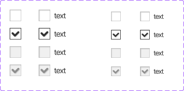

This documents describe checkbox component . The buttons is extended from **Checkbox** components from PrimeVue UI-Kit collection.
You can read more about it [here](https://primevue.org/checkbox/)



The CSS class was written in file **welfare-checkbox.css**. The Vue component is **WelfareCheckbox**.
You can see detail more in file **CheckboxView**.

```html
  <WelfareCheckbox v-model="value1" />
  <WelfareCheckbox v-model="value2" class="ml-36" label="text" />
  <WelfareCheckbox class="ml-36" :model-value="true" disabled label="text" />
  <WelfareCheckbox class="ml-40" :model-value="true" disabled size="sm" label="text" />
```

#### Props
We extends  [**Checkbox**](https://primevue.org/checkbox/) props (PrimeVue) (exclude: aria-labelledby,aria-label). Below, we add some additional props properties in **WelfareCheckbox** component.
Name  | Type  | Description
------------- | ------------- | -------------
modelValue | any | Value of the component.	
label  | string | Label of the checbox.
size  | 'sm','md' | The size of checkbox
class  | any | Style class of the button.	
buttonType  | "neatral", "default", "cancel"  | The type of button.
#### Emits
Defines valid emits in **WelfareCheckbox** component.
Name  | Parameters |   ReturnType  | Description
------------- |  ------------- | ------------- | -------------
change  | event:Event | void | Callback to invoke on value change.	
click  | event:MouseEvent | void | Callback to invoke on value click.	
update:page  | value:any | void | Emitted when the page changes.
update:modelValue  | value:any | void | Emitted when the value changes.