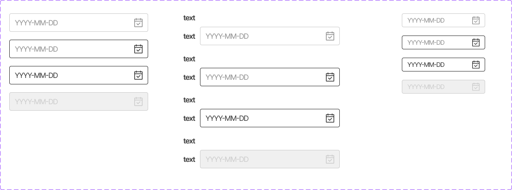

This documents describe date-time picker component. 



The CSS class was written in file **welfare-calendar.css**. The Vue component is **WelfareDateTimePicker**.
You can see detail more in file **DatePickerView** and **DateTimePickerView**.

```html
      <WelfareDateTimePicker v-model="date.date" :type="'date'" />
      <WelfareDateTimePicker v-model="date1.date" :type="'date'" />
      <WelfareDateTimePicker v-model="date2.date" :type="'date'" />
      <WelfareDateTimePicker v-model="date3.date" :type="'date'" :disabled="date3.disabled" />

      <WelfareDateTimePicker v-model="date.date" :type="'date-time'" />
      <WelfareDateTimePicker v-model="date1.date" :format="date1.format" />
      <WelfareDateTimePicker v-model="date2.date" :format="date2.format" />
      <WelfareDateTimePicker v-model="date3.date" :format="date3.format" :disabled="date3.disabled" />
```

#### Props
Defines valid properties in **WelfareDateTimePicker** component.
Name  | Type  | Description
------------- | ------------- | -------------
modelValue | any | Value of the component.	
type  | 'date',date-time | The type date time, only date or date-time
disabled  | boolean | Mark date time picker in disabled state
size  | 'small', normal | The size of date-time picker
format  | string  | The output format date time 
#### Emits
Defines valid emits in **WelfareDateTimePicker** component.
Name  | Parameters |   ReturnType  | Description
------------- |  ------------- | ------------- | -------------
update:modelValue  | value:any | void | Emitted when the value changes.
