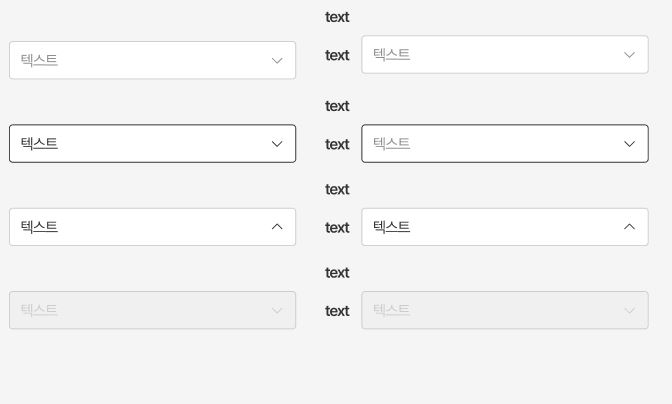

This documents describe select (Dropdown) component . The buttons is extended from **Dropdown** component from PrimeVue UI-Kit collection.
You can read more about it [here](https://primevue.org/dropdown/)



The CSS class was written in file **welfare-select.css**. The Vue component is **WelfareSelect**.
You can see detail more in file **SelectView**.

```html
<script setup lang="ts">
  const options: WelfareSelectOptionType[] = [
    { label: '하위분류 체계 정리 01', value: '1' },
    { label: '하위분류 체계 정리 02', value: '2' },
    { label: '하위분류 체계 정리 03', value: '3' }
  ]
</script>
<template>
  <WelfareSelect v-model="defaultSelectFirst" placeholder="텍스트" optionLabel="label" :options="options" />
  <WelfareSelect v-model="defaultSelectThird" placeholder="텍스트" optionLabel="label" :options="options" />
  <WelfareSelect v-model="smallSelectFirst" placeholder="텍스트" optionLabel="label" :options="options" small />
  <WelfareSelect v-model="smallSelectFirst" placeholder="텍스트" optionLabel="label" :options="options" disabled small />
</template>
```

#### Props

We extends [**Dropdown**](https://primevue.org/dropdown/) props (PrimeVue) (exclude: aria-labelledby,aria-label). Below, we add some additional props properties in **WelfareSelect** component.
Name | Type | Description
------------- | ------------- | -------------
modelValue | any | Value of the component.	
options | any | An array of selectitems to display as the available options.	
small | boolean | Mark select has size is small
bigRadius | boolean | Mark select has border radius
labelTop | string | The top left label of the select
labelLeft | string | The left label of the select
isError | boolean | The select has active error state
class | css | The CSS class of the select

#### Emits

Defines valid emits in **WelfareSelect** component.
Name | Parameters | ReturnType | Description
------------- | ------------- | ------------- | -------------
update:modelValue | value:any | void | Emitted when the value changes.
