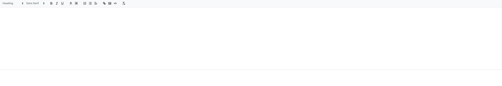

This documents describe Editor component . The buttons is extended from **Editor** component from PrimeVue UI-Kit collection.
You can read more about it [here](https://primevue.org/editor/)



The CSS class was written in file **welfare-editor.css**. The Vue component is **WelfareEditor**.
You can see detail more in file **EditorView**.

**Table of Contents**

[TOC]

##  Setup and install


```html
  const value = ref('')
  <WelfareEditor v-model="value" />
```

#### Props

Defines valid properties in **WelfareEditor** component.

Name | Type | Description
------------- | ------------- | -------------
modelValue | any | Value of the component.	
editorStyle | any | Style of the component
placeholder | string | The placeholder of the editor component
readonly | boolean | Mark editor is in readonly mode

#### Emits

Defines valid emits in **WelfareEditor** component.
Name | Parameters | ReturnType | Description
------------- | ------------- | ------------- | -------------
update:modelValue | value:any | void | Emitted when the value changes.

