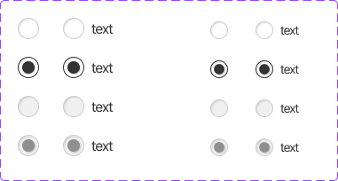

This documents describe radio button component . The buttons is extended from **Radio button** components from PrimeVue UI-Kit collection.
You can read more about it [here](https://primevue.org/radiobutton/)



The CSS class was written in file **welfare-radio.css**. The Vue component is **WelfareRadio**.
You can see detail more in file **RadioView**.

```html
  <WelfareRadio v-model="value1" name="radio" value="radio" />
  <WelfareRadio v-model="value1" value="test2" name="radio-ck" />
  <WelfareRadio value="radio-ck-2" label="text" class="ml-31" name="radio-la-sm-di" disabled size="sm" />
  <WelfareRadio model-value="value1" value="radio-ck-5" class="ml-109" name="radio-sm-ck-di" disabled size="sm" />
```

#### Props
We extends  [**Checkbox**](https://primevue.org/radiobutton/) props (PrimeVue) (exclude: aria-labelledby,aria-label). Below, we add some additional props properties in **WelfareRadio** component.
Name  | Type  | Description
------------- | ------------- | -------------
modelValue | any | Value of the component.	
label  | string | Label of the radio.
size  | 'sm','md' | The size of radio
#### Emits
Defines valid emits in **WelfareRadio** component.
Name  | Parameters |   ReturnType  | Description
------------- |  ------------- | ------------- | -------------
change  | event:Event | void | Callback to invoke on radio button value change.	
click  | event:Event | void | Callback to invoke on radio button click.	
update:modelValue  | value:any | void | Emitted when the value changes.