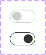

This documents describe Switch component . The buttons is extended from **Checkbox** components from PrimeVue UI-Kit collection.
You can read more about it [here](https://primevue.org/inputswitch/)



The CSS class was written in file **welfare-switch.css**. The Vue component is **WelfareSwitch**.
You can see detail more in file **SwitchView**.

```html
 <WelfareSwitch/>
 <WelfareSwitch :modelValue='true'/>
```

#### Props
We extends  [**Switch**](https://primevue.org/inputswitch/) props (PrimeVue) (exclude: aria-labelledby,aria-label). Below, we add some additional props properties in **WelfareSwitch** component.
Name  | Type  | Description
------------- | ------------- | -------------
modelValue | any | Specifies whether a inputswitch should be checked or not.
#### Emits
Defines valid emits in **WelfareCheckbox** component.
Name  | Parameters |   ReturnType  | Description
------------- |  ------------- | ------------- | -------------
update:modelValue  | value:boolean | void | Emitted when the value changes.	