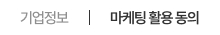
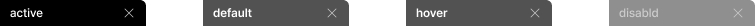
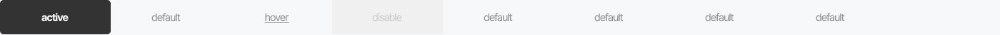
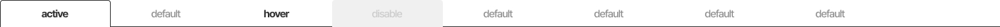

This documents describe Tab component . The Tab is extended from **TabView** component from PrimeVue UI-Kit collection.
You can read more about it [here](https://primevue.org/tabview/)

The CSS class was written in file **welfare-tab.css**.

**Table of Contents**

[TOC]

## only text (탭탭탭탭 스타일)

The Vue component is **WelfareTabText**. You can see detail more in file **TabTextView**.



```html
 */
const tabPanelProps = [
  { header: '기업정보', disabled: false, pt: {} },
  { header: '마케팅 활용 동의', disabled: true, pt: {} },
  { header: '마케팅 활용 동의', disabled: false, pt: {} }
]
   <WelfareTabText @tab-change="handleTabChange" @tab-click="handleTabClick" :activeIndex="currentActive" :wfTabPanelProps="tabPanelProps">
      <template #wf-tab-text-content="{ tabIndex }">
        <div>Tab {{ tabIndex }} content</div>
      </template>
    </WelfareTabText>
```

#### Props
We extends  [**TabView**](https://primevue.org/tabview/) props (PrimeVue) (exclude: aria-labelledby,aria-label). Below, we add some additional props properties in **WelfareTabText** component.
Name  | Type  | Description
------------- | ------------- | -------------
wfTabPanelProps | any:TabPanelProps | Panel props to pass to panel view
#### Emits
Defines valid emits in **WelfareTabText** component.
Name  | Parameters |   ReturnType  | Description
------------- |  ------------- | ------------- | -------------
tab-change  | event:TabViewChangeEvent | void | Callback to invoke when an active tab is changed.	
tab-click  | event:TabViewClickEvent | void | Callback to invoke when an active tab is clicked.	
#### Slots
Defines valid slots in **WelfareTabText** component.
Name  | Parameters |   ReturnType  | Description
------------- |  ------------- | ------------- | -------------
wf-tab-text-content  | tabIndex: number | void | The content of tab
##  single tab (탭 스타일)

The Vue component is **WelfareTabSingle**. You can see detail more in file **TabSingleView**.



```html
<WelfareTabSingle
      @tab-change="handleTabChange"
      @tab-click="handleTabClick"
      @tab-close="handleCloseTab"
      :activeIndex="currentActive"
      :wfTabPanelProps="tabPanelProps"
    >
      <template #wf-tab-text-content="{ tabIndex }">
        <div>Tab {{ tabIndex }} content</div>
      </template>
    </WelfareTabSingle>
```

#### Props
We extends  [**TabView**](https://primevue.org/tabview/) props (PrimeVue) (exclude: aria-labelledby,aria-label). Below, we add some additional props properties in **WelfareTabSingle** component.
Name  | Type  | Description
------------- | ------------- | -------------
wfTabPanelProps | any:TabPanelProps | Panel props to pass to panel view
#### Emits
Defines valid emits in **WelfareTabSingle** component.
Name  | Parameters |   ReturnType  | Description
------------- |  ------------- | ------------- | -------------
tab-change  | event:TabViewChangeEvent | void | Callback to invoke when an active tab is changed.	
tab-click  | event:TabViewClickEvent | void | Callback to invoke when an active tab is clicked.	
tab-close  | event:CloseTabPayload | void | Callback to invoke when tab close.	
#### Slots
Defines valid slots in **WelfareTabSingle** component.
Name  | Parameters |   ReturnType  | Description
------------- |  ------------- | ------------- | -------------
wf-tab-text-content  | tabIndex: number | void | The content of tab


## tab (탭탭 스타일)

The Vue component is **WelfareTabFilled**. You can see detail more in file **TabFilledView**.



```html
    <WelfareTabFilled @tab-change="handleTabChange" @tab-click="handleTabClick" :activeIndex="currentActive" :wfTabPanelProps="tabPanelProps">
      <template #wf-tab-text-content="{ tabIndex }">
        <div>Tab {{ tabIndex }} content</div>
      </template>
    </WelfareTabFilled>
```

#### Props
We extends  [**TabView**](https://primevue.org/tabview/) props (PrimeVue) (exclude: aria-labelledby,aria-label). Below, we add some additional props properties in **WelfareTabFilled** component.
Name  | Type  | Description
------------- | ------------- | -------------
wfTabPanelProps | any:TabPanelProps | Panel props to pass to panel view
#### Emits
Defines valid emits in **WelfareTabFilled** component.
Name  | Parameters |   ReturnType  | Description
------------- |  ------------- | ------------- | -------------
tab-change  | event:TabViewChangeEvent | void | Callback to invoke when an active tab is changed.	
tab-click  | event:TabViewClickEvent | void | Callback to invoke when an active tab is clicked.	
#### Slots
Defines valid slots in **WelfareTabFilled** component.
Name  | Parameters |   ReturnType  | Description
------------- |  ------------- | ------------- | -------------
wf-tab-text-content  | tabIndex: number | void | The content of tab


##  tab outline (탭탭탭 스타일)

The Vue component is **WelfareTabOutline**. You can see detail more in file **TabOutlineView**.



```html
    <WelfareTabOutline @tab-change="handleTabChange" @tab-click="handleTabClick" :activeIndex="currentActive" :wfTabPanelProps="tabPanelProps">
      <template #wf-tab-text-content="{ tabIndex }">
        <div>Tab {{ tabIndex }} content</div>
      </template>
    </WelfareTabOutline>
```

#### Props
We extends  [**TabView**](https://primevue.org/tabview/) props (PrimeVue) (exclude: aria-labelledby,aria-label). Below, we add some additional props properties in **WelfareTabOutline** component.
Name  | Type  | Description
------------- | ------------- | -------------
wfTabPanelProps | any:TabPanelProps | Panel props to pass to panel view
#### Emits
Defines valid emits in **WelfareTabOutline** component.
Name  | Parameters |   ReturnType  | Description
------------- |  ------------- | ------------- | -------------
tab-change  | event:TabViewChangeEvent | void | Callback to invoke when an active tab is changed.	
tab-click  | event:TabViewClickEvent | void | Callback to invoke when an active tab is clicked.	
#### Slots
Defines valid slots in **WelfareTabOutline** component.
Name  | Parameters |   ReturnType  | Description
------------- |  ------------- | ------------- | -------------
wf-tab-text-content  | tabIndex: number | void | The content of tab


##  tab underline

The Vue component is **WelfareTabUnderline**.


```html
    <WelfareTabUnderline @tab-change="handleTabChange" @tab-click="handleTabClick" :activeIndex="currentActive" :wfTabPanelProps="tabPanelProps">
      <template #wf-tab-text-content="{ tabIndex }">
        <div>Tab {{ tabIndex }} content</div>
      </template>
    </WelfareTabUnderline>
```

#### Props
We extends  [**TabView**](https://primevue.org/tabview/) props (PrimeVue) (exclude: aria-labelledby,aria-label). Below, we add some additional props properties in **WelfareTabUnderline** component.
Name  | Type  | Description
------------- | ------------- | -------------
wfTabPanelProps | any:TabPanelProps | Panel props to pass to panel view
#### Emits
Defines valid emits in **WelfareTabUnderline** component.
Name  | Parameters |   ReturnType  | Description
------------- |  ------------- | ------------- | -------------
tab-change  | event:TabViewChangeEvent | void | Callback to invoke when an active tab is changed.	
tab-click  | event:TabViewClickEvent | void | Callback to invoke when an active tab is clicked.	
#### Slots
Defines valid slots in **WelfareTabUnderline** component.
Name  | Parameters |   ReturnType  | Description
------------- |  ------------- | ------------- | -------------
wf-tab-text-content  | tabIndex: number | void | The content of tab
