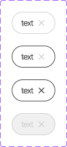

This documents describe Tag component.

**Table of Contents**




The CSS class was written in file **welfare-tag.css**. The Vue component is **WelfareSwitch**.
You can see detail more in file **TagView**.

```html
<!-- default-->
    <WelfareTag>text</WelfareTag>
    <WelfareTag class='wf-tag-hover'>text</WelfareTag>
    <WelfareTag class='wf-tag-hover wf-tag-active'>text</WelfareTag>
    <WelfareTag disabled> text</WelfareTag>
```

#### Props
Defines valid properties in **WelfareTag** component.
Name  | Type  | Description
------------- | ------------- | -------------
disabled | boolean | The disable state of tag.
#### Emits
Defines valid emits in **WelfareCheckbox** component.
Name  | Parameters |   ReturnType  | Description
------------- |  ------------- | ------------- | -------------
click  |  | void | Emitted when the click to tag
iconClick  |  | void | Emitted when the click to icon close in tag
