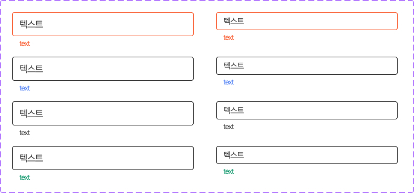

This documents describe input text component. The buttons is extended from **Input Text** components from PrimeVue UI-Kit collection.
You can read more about it [here](https://primevue.org/inputtext/)

**Table of Contents**

[TOC]


## Input Text

The CSS class was written in file **welfare-input.css**. The Vue component is **WelfareInputText**.
You can see detail more in file **InputTextView**.

```html
   <WelfareInputText inputType="text" class="wrap-input" placeholder="텍스트" />
   <WelfareInputText labelTop="text" labelLeft="text" labelBottomLeft="text" inputType="text" class="wrap-input" placeholder="텍스트" />
   <WelfareInputText size="small" labelTop="text" labelLeft="text" labelBottomLeft="text" inputType="text" class="wrap-input wf-text-box-active"  placeholder="텍스트" />
   <WelfareInputText inputType="text" class="wrap-input wf-text-box-active" placeholder="텍스트" />
```

#### Props
Defines valid properties in **WelfareInputText** component.
Name  | Type  | Description
------------- | ------------- | -------------
modelValue  | string | Text of the input text.
size  | 'small', 'large' | Size of input text
labelTop  | string | The label top of input text
labelLeft  | string | The label left of input text
labelBottomLeft  | string | The label bottom left of input text
labelBottomRight  | string | The label bottom right of input text
inputType  | any | The input type of input text
icon  | any | The icon of right button
#### Emits
Defines valid emits in **WelfareInputText** component.
Name  | Parameters |   ReturnType  | Description
------------- |  ------------- | ------------- | -------------
update:modelValue  | value: any | void | Emitted when the value changes.
clickIconRight  | value: Event | void | Emitted when click to right icon

## Input Text with validation 




The CSS class was written in file **welfare-input.css**. The Vue component is **WelfareInputText**.
You can see detail more in file **InputTextValidationView**.

```html
        <div class="wf-space-y-16">
            <WelfareInputText labelBottomLeft="text" inputType="text" v-model="defaultInputTextFirst" class="wrap-input wf-text-box-negative wf-validation-box-red" placeholder="텍스트" />   
            <WelfareInputText labelBottomLeft="text" inputType="text" v-model="defaultInputTextSecond" class="wrap-input wf-validation-box-blue" placeholder="텍스트" />   
            <WelfareInputText labelBottomLeft="text" inputType="text" v-model="defaultInputTextThird" class="wrap-input wf-validation-box-n-33" placeholder="텍스트" />   
            <WelfareInputText labelBottomLeft="text" inputType="text" v-model="defaultInputTextFour" class="wrap-input wf-validation-box-green" placeholder="텍스트" />   
        </div>
        <div class="wf-space-y-26">
            <WelfareInputText size="small" labelBottomLeft="text" inputType="text" v-model="defaultSmallInputTextFirst" class="wrap-input wf-text-box-negative wf-validation-box-red" placeholder="텍스트" />   
            <WelfareInputText size="small" labelBottomLeft="text" inputType="text" v-model="defaultSmallInputTextSecond" class="wrap-input wf-validation-box-blue" placeholder="텍스트" />   
            <WelfareInputText size="small" labelBottomLeft="text" inputType="text" v-model="defaultSmallInputTextThird" class="wrap-input wf-validation-box-n-33" placeholder="텍스트" />   
            <WelfareInputText size="small" labelBottomLeft="text" inputType="text" v-model="defaultSmallInputTextFour" class="wrap-input wf-validation-box-green" placeholder="텍스트" /> 
        </div>
```