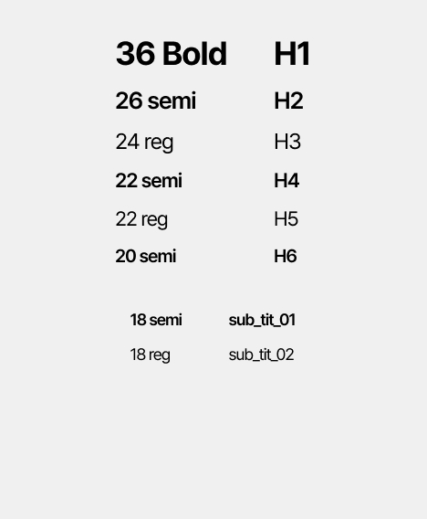
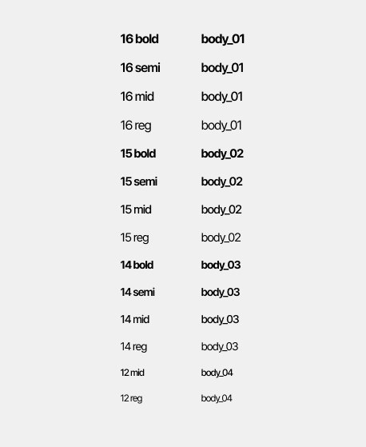

This documents describe head title, sub-title and body text styles.

**Table of Contents**

[TOC]


##  Head and sub-title
The class was written in file welfare-text.css



```css
	h1 {
		  font-size: var(--h1);
		  font-style: normal;
		  font-weight: var(--w-700);
		  line-height: 100%; /* 2.25rem */
		  letter-spacing: var(--ls_-1);
	}

	h2 {
		  font-size: var(--h2);
		  font-style: normal;
		  font-weight: var(--w-600);
		  line-height: 100%; /* 1.625rem */
		  letter-spacing: var(--ls_-1);
	}

	h3 {
		  font-size: var(--h3);
		  font-style: normal;
		  font-weight: var(--w-400);
		  line-height: 100%; /* 1.5rem */
		  letter-spacing: var(--ls_-1);
	}

	h4 {
		  font-size: var(--h4);
		  font-style: normal;
		  font-weight: var(--w-600);
		  line-height: 100%; /* 1.375rem */
		  letter-spacing: var(--ls_-1);
	}

	h5 {
		  font-size: var(--h5);
		  font-style: normal;
		  font-weight: var(--w-400);
		  line-height: 100%; /* 1.375rem */
		  letter-spacing: var(--ls_-1);
	}

	h6 {
		  font-size: var(--h6);
		  font-style: normal;
		  font-weight: var(--w-600);
		  line-height: 100%; /* 1.25rem */
		  letter-spacing: var(--ls_-1);
	}

	.wf-sub_tit_01 {
		  font-size: var(--sub_tit_01);
		  font-style: normal;
		  font-weight: var(--w-600);
		  line-height: 100%; /* 1.125rem */
		  letter-spacing: var(--ls_-1);
	}

	.wf-sub_tit_02 {
		  font-size: var(--sub_tit_02);
		  font-style: normal;
		  font-weight: var(--w-400);
		  line-height: 100%; /* 1.125rem */
		  letter-spacing: var(--ls_-1);
	}
```

## Body text
The class was written in file welfare-text.css



```css
  .wf-body_01-bold {
    font-size: var(--body_01);
    font-style: normal;
    font-weight: var(--w-700);
    line-height: 100%; /* 1rem */
    letter-spacing: var(--ls_-1);
  }

  .wf-body_01-semi {
    font-size: var(--body_01);
    font-style: normal;
    font-weight: var(--w-600);
    line-height: 100%; /* 1rem */
    letter-spacing: var(--ls_-1);
  }

  .wf-body_01-mid {
    font-size: var(--body_01);
    font-style: normal;
    font-weight: var(--w-500);
    line-height: 100%; /* 1rem */
    letter-spacing: var(--ls_-1);
  }

  .wf-body_01-reg {
    font-size: var(--body_01);
    font-style: normal;
    font-weight: var(--w-400);
    line-height: 100%; /* 1rem */
    letter-spacing: var(--ls_-1);
  }

  .wf-body_02-bold {
    font-size: var(--body_02);
    font-style: normal;
    font-weight: var(--w-700);
    line-height: 100%; /* 0.9375rem */
    letter-spacing: var(--ls_-1);
  }

  .wf-body_02-semi {
    font-size: var(--body_02);
    font-style: normal;
    font-weight: var(--w-600);
    line-height: 100%; /* 0.9375rem */
    letter-spacing: var(--ls_-1);
  }

  .wf-body_02-mid {
    font-size: var(--body_02);
    font-style: normal;
    font-weight: var(--w-500);
    line-height: 100%; /* 0.9375rem */
    letter-spacing: var(--ls_-1);
  }

  .wf-body_02-reg {
    font-size: var(--body_02);
    font-style: normal;
    font-weight: var(--w-400);
    line-height: 100%; /* 0.9375rem */
    letter-spacing: var(--ls_-1);
  }


  .wf-body_03-bold {
    font-size: var(--body_03);
    font-style: normal;
    font-weight: var(--w-700);
    line-height: 100%; /* 0.875rem */
    letter-spacing: var(--ls_-1);
  }

  .wf-body_03-semi {
    font-size: var(--body_03);
    font-style: normal;
    font-weight: var(--w-600);
    line-height: 100%; /* 0.875rem */
    letter-spacing: var(--ls_-1);
  }

  .wf-body_03-mid {
    font-size: var(--body_03);
    font-style: normal;
    font-weight: var(--w-500);
    line-height: 100%; /* 0.875rem */
    letter-spacing: var(--ls_-1);
  }

  .wf-body_03-reg {
    font-size: var(--body_03);
    font-style: normal;
    font-weight: var(--w-400);
    line-height: 100%; /* 0.875rem */
    letter-spacing: var(--ls_-1);
  }

  .wf-body_04-mid {
    font-size: var(--body_04);
    font-style: normal;
    font-weight: var(--w-500);
    line-height: 100%; /* 0.75rem */
    letter-spacing: var(--ls_-1);
  }

  .wf-body_04-reg {
    font-size: var(--body_04);
    font-style: normal;
    font-weight: var(--w-400);
    line-height: 100%; /* 0.75rem */
    letter-spacing: var(--ls_-1);
  }
```

